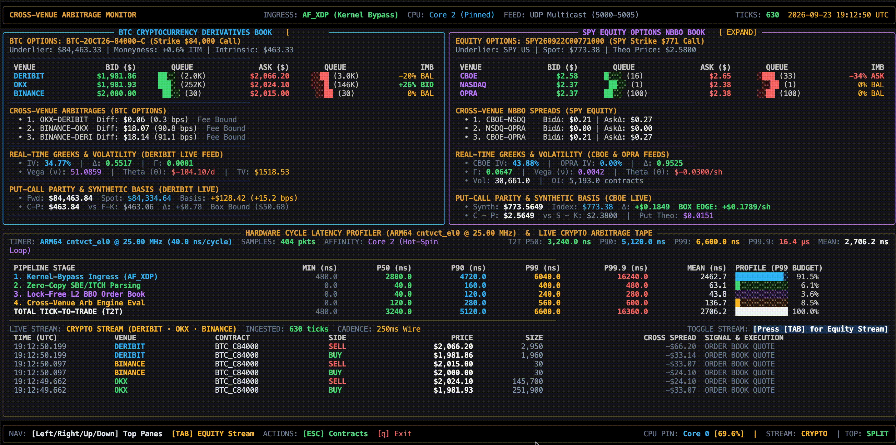

# Ultra-Low-Latency Cross-Venue Arbitrage Terminal

[](engine/)
[](engine/)
[](engine/)
[](kdb/)
[](gateways/)
[](LICENSE)

An institutional-grade, ultra-low-latency arbitrage pipeline and Bloomberg-style dual-pane terminal for cross-venue options and spot markets across Equity and Crypto.

---

## Live Terminal

<p align="center">
  
</p>

---

## Architecture Overview

```
                                  ┌────────────────────────┐
                                  │   6 Exchange Gateways  │
                                  │  (3 Equity + 3 Crypto) │
                                  └───────────┬────────────┘
                                              │ UDP Multicast (Ports 5000-5005)
                     ┌────────────────────────┴────────────────────────┐
                     ▼                                                 ▼
        ┌─────────────────────────┐                       ┌─────────────────────────┐
        │   C++20 Engine (ULL)    │                       │      KDB+ Pipeline      │
        │  • Solarflare / AF_XDP  │                       │  • Multicast Subscriber │
        │  • Kernel-Bypass Sockets│                       │  • In-Memory Tickerplant│
        │  • Zero-Copy Parsing    │                       │  • Port 5020 (tp.q)     │
        │  • Lock-Free L2 Books   │                       └────────────┬────────────┘
        │  • Cycle Latency (rdtsc)│                                    │
        └────────────┬────────────┘                                    │
                     │                                                 │
                     └────────────────────────┬────────────────────────┘
                                              ▼
                                 ┌─────────────────────────────┐
                                 │   Bloomberg-Style Terminal  │
                                 │       (sudo ./start.sh)     │
                                 └─────────────────────────────┘
```

### 1. Market Data Gateways (`gateways/`)
- **6 Multi-Venue Pipelines**: 3 Equity (CBOE `UDP 5000`, Nasdaq `UDP 5001`, OPRA `UDP 5002`) and 3 Crypto venues (Deribit `UDP 5003`, OKX `UDP 5004`, Binance `UDP 5005`).
- **Binary Normalization**: Normalizes exchange L2 books and trades into compact binary packets broadcast over dedicated UDP multicast feeds.
- **Real-Time Quant Greeks**: In-flight Black-Scholes Greeks ($\Delta$, $\Gamma$, $\nu$, $\Theta$, IV) and Put-Call Parity arbitrage signals across 10 core assets.

### 2. C++20 Ultra-Low-Latency Engine (`engine/`)
- **Dual Kernel-Bypass Ingress (Solarflare Onload + AF_XDP)**:
  - **Solarflare OpenOnload / `ef_vi` Scan**: Proactive hardware scanner probes PCIe network adapters for Solarflare vendor IDs (`0x1924` for Solarflare Communications, `0x10ee` for AMD/Xilinx SFC), `/dev/onload` character devices, and active Onload namespaces. Configures `SO_BUSY_POLL` spinning and user-space direct-NIC DMA when present.
  - **Linux AF_XDP Fallback**: If Solarflare hardware is not present on the bus, automatically activates native Linux AF_XDP (eXpress Data Path) zero-copy ring buffers (`UMEM`, Fill Ring, Rx Ring) and non-blocking socket rings to bypass the kernel network stack without manual intervention.
- **Zero-Copy & Lock-Free Design**: In-place pointer-cast packet parsing with 64-byte cacheline-aligned (`alignas(64)`) lock-free L2 BBO order books.
- **Core Pinning & Latency Profiling**: Thread isolated and pinned to CPU Core 2; hardware cycle timers (`rdtsc` / `cntvct_el0`) capture nanosecond stage-by-stage percentiles (P50, P90, P99, P99.9).

### 3. KDB+/q Streaming Pipeline (`kdb/`)
- **In-Memory Tickerplant (`kdb/tp.q`)**: High-throughput columnar database running on port `5020`, streaming live `SpotBook` and `OptBook` tables.
- **Asynchronous Subscriber (`kdb/multicast_sub.py`)**: Consumes multicast UDP frames and streams vectorized tick records into KDB+ via `qPython`.

### 4. Bloomberg-Style Terminal Interface (`scripts/bloomberg_tui.py`)
- **Dual-Pane Options Matrix**: Simultaneous side-by-side L2 Depth-of-Market books for both Crypto and Equity options.
- **Independent Stream Toggling (`[TAB]`)**: Toggles bottom tape between single-asset Crypto and Equity streams without affecting top books.
- **Contract Discovery (`[ESC]`)**: Dynamic options matrix to browse and hot-swap active strikes and expiries across all 10 assets.
- **Live Hardware Telemetry**: Real-time dock displaying pinned CPU utilization and nanosecond pipeline latency percentiles.

---

## Prerequisites & Installation

### 1. System Packages (`sudo apt` / `snap`)
Install C++20 build tools, Clang/LLVM for eBPF compilation, Linux kernel headers, and AF_XDP/BPF development libraries:

**Via APT (Standard Ubuntu/Debian):**
```bash
sudo apt update && sudo apt install -y \
    build-essential \
    clang \
    llvm \
    libbpf-dev \
    libxdp-dev \
    linux-headers-$(uname -r) \
    python3 \
    python3-pip \
    python3-venv \
    rlwrap
```

**Via Snap (Optional / Alternative):**
If you manage your developer toolchain via `snap`, Clang and packaging tools can alternatively be installed with:
```bash
# Optional snap toolchain installations
sudo snap install --classic clangd
```
> [!NOTE]
> Host kernel headers (`linux-headers-$(uname -r)`), `libbpf-dev`, and `libxdp-dev` must be installed through `apt` to match your running kernel release for eBPF/AF_XDP driver bindings.

### 2. Python Dependencies (`requirements.txt`)
Install the required asynchronous networking, quantitative calculation, and terminal rendering packages:

```bash
pip install -r requirements.txt
```

### 3. KDB+/q Engine & License
The tick pipeline runs on **KDB+/q**. Download the free personal evaluation edition for Linux from [Kx Systems](https://kx.com/download/):
- Unzip the downloaded archive (e.g. `l64.zip`) into `~/q`:
  ```bash
  mkdir -p ~/q
  unzip l64.zip -d ~/q
  ```
- Copy your KX license file (`kc.lic` or `k4.lic` received by email from KX) to `~/q/`:
  ```bash
  cp /path/to/kc.lic ~/q/
  ```
- Add `q` and `QHOME` to your shell profile (`~/.bashrc`):
  ```bash
  export QHOME="$HOME/q"
  export PATH="$QHOME/l64:$PATH"
  ```
> [!TIP]
> `./start.sh` automatically detects and exports `QHOME=~/q` and `PATH=$HOME/q/l64:$PATH` if `~/q` or `~/.kx` is present.


---

## Quick Start

The entire pipeline and trading terminal are managed through `./start.sh`.

```bash
# Launch Bloomberg-style terminal TUI directly (runs directly as standard user)
./start.sh

# Check real-time process health and PIDs of all components
./start.sh --status

# Restart all infrastructure services (KDB+, subscriber, engine, gateways)
./start.sh --restart all

# Query live KDB+ tick counts, cross-venue prices, and quant Greeks
./start.sh --query

# View hardware latency benchmarks from the C++ engine
./start.sh --benchmark

# Display full CLI manual
./start.sh --help
```

---

## Terminal Navigation

| Key | Action |
| :--- | :--- |
| `[TAB]` | Toggle lower live stream tape between **Crypto** and **Equity** |
| `[Left]` / `[c]` | Expand Crypto options pane (100% width) |
| `[Right]` / `[e]` | Expand Equity options pane (100% width) |
| `[Up]` / `[Down]` / `[b]` | Reset to 50/50 Dual-Pane Split mode |
| `[ESC]` | Return to / open the Contract Discovery & Selection screen |
| `[q]` | Exit the terminal |

---

## Directory Structure

```text
├── engine/              # C++20 lock-free execution engine & AF_XDP kernel bypass
├── gateways/            # 6 market data gateways and contract definitions
├── kdb/                 # KDB+ tickerplant (tp.q), schemas, and multicast subscriber
├── scripts/             # Controller (control.py), Bloomberg TUI, contract selector
├── start.sh             # Root-level launcher and CLI management script
├── requirements.txt     # Core Python library dependencies
└── .gitignore           # Repository ignore rules (ignores .md except READMEs)
```
